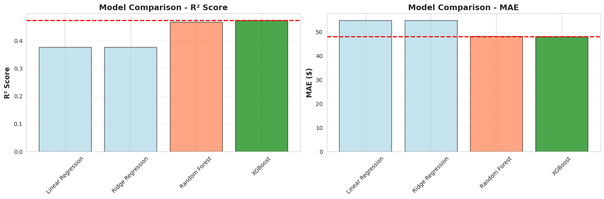
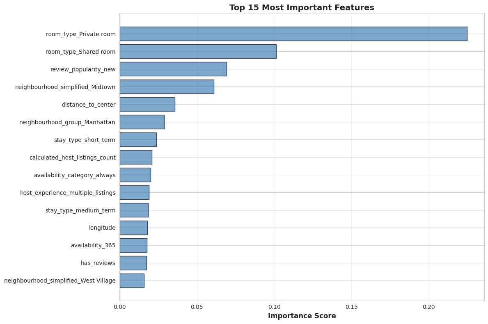

# Airbnb Price Prediction - NYC 2019

Machine learning project to predict Airbnb listing prices in New York City using regression models, AWS S3 for data storage, and MLflow for experiment tracking.

## Project Overview

This project implements an end-to-end ML pipeline to predict nightly prices for Airbnb listings in NYC. The model helps hosts set competitive prices and provides insights into factors that influence pricing.

**Dataset:** AB_NYC_2019 (48,895 listings with 16 features)

**Best Model Performance:**
- **Algorithm:** XGBoost Regressor
- **Test R²:** 0.469 (explains 46.92% of price variance)
- **Test MAE:** $48.30 (average prediction error)
- **Accuracy:** 70.9% of predictions within ±$50

---

## Project Architecture
```
Data Storage (AWS S3)
    ↓
Data Processing Pipeline
    ↓
Feature Engineering
    ↓
Model Training (4 algorithms)
    ↓
MLflow Experiment Tracking
    ↓
Model Registry (Production)
```

---

## 📁 Repository Structure
```
airbnb-price-prediction/
├── README.md                          # Project documentation
├── requirements.txt                   # Python dependencies
├── .gitignore                         # Git ignore rules
├── notebooks/
│   └── airbnb_ml_pipeline.ipynb      # Complete ML pipeline
├── data/
│   └── Ab_Nyc2019_Data_Dictionary.docx
└── screenshots/
    ├── mlflow_experiments.png        # MLflow UI experiments view
    ├── model_comparison.png          # Model performance comparison
    └── feature_importance.png        # Top features visualization
```

---

## Setup Instructions

### Prerequisites
- Python 3.8+
- AWS Account (Free Tier sufficient)
- Git

### Installation

1. **Clone the repository**
```bash
git clone https://github.com/yourusername/airbnb-price-prediction.git
cd airbnb-price-prediction
```

2. **Create virtual environment**
```bash
python -m venv venv
source venv/bin/activate  # On Windows: venv\Scripts\activate
```

3. **Install dependencies**
```bash
pip install -r requirements.txt
```

4. **Configure AWS credentials**
```bash
# Create IAM user with S3 access
# Set environment variables:
export AWS_ACCESS_KEY_ID="your-access-key"
export AWS_SECRET_ACCESS_KEY="your-secret-key"
export AWS_DEFAULT_REGION="us-east-1"
```

5. **Run the notebook**
```bash
jupyter notebook notebooks/airbnb_ml_pipeline.ipynb
```

---

## Methodology

### 1. Exploratory Data Analysis (EDA)
- Analyzed 48,895 listings across 5 NYC boroughs
- Identified missing values (20.6% in review columns)
- Detected outliers and anomalies in pricing
- Discovered strong categorical predictors (location, room type)

### 2. Data Preprocessing
- **Missing values:** Imputed with business logic (reviews_per_month = 0 for new listings)
- **Outliers:** Removed extreme prices ($0 and >$1000)
- **Feature engineering:** Created 7 new features
  - `distance_to_center` (Haversine formula from Times Square)
  - `stay_type` (flexible, short_term, medium_term, long_term)
  - `host_experience` (single, few, multiple, professional)
  - `review_popularity` (new, low, medium, high)
  - `has_reviews` (binary)
  - `availability_category` (low, medium, high, always)
  - `neighbourhood_simplified` (reduced from 221 to 25 categories)

### 3. Feature Engineering & Encoding
- **One-hot encoding** for categorical variables (7 features → 42 columns)
- **StandardScaler** for numerical features (fit on train only)
- Final feature set: 51 features

### 4. Model Development
Trained and compared 4 regression algorithms:

| Model | Test R² | Test MAE | Test RMSE | Training Time |
|-------|---------|----------|-----------|---------------|
| Linear Regression | 0.377 | $54.93 | $93.23 | 0.43s |
| Ridge Regression | 0.377 | $54.89 | $93.24 | 0.05s |
| Random Forest | 0.467 | $48.19 | $86.20 | 35.27s |
| **XGBoost** ✅ | **0.469** | **$48.30** | **$86.06** | **3.37s** |

**Winner:** XGBoost - Best performance with acceptable training time and minimal overfitting.

### 5. MLflow Experiment Tracking
- Logged parameters, metrics, and artifacts for all models
- Created visualizations (prediction plots, residuals)
- Registered best model in MLflow Model Registry
- Transitioned to "Production" stage

---

## Key Findings

### Top Predictive Features
1. **room_type_Private room** (24.11% importance)
2. **room_type_Shared room** (11.22% importance)
3. **neighbourhood_simplified_Midtown** (6.20% importance)
4. **distance_to_center** (3.97% importance)
5. **host_experience_professional** (3.31% importance)

### Model Performance by Segment

**By Borough:**
- Best: Queens (MAE: $32.19)
- Worst: Staten Island (MAE: $62.88)

**By Room Type:**
- Best: Private room (MAE: $27.62)
- Worst: Entire home/apt (MAE: $67.85)

**By Price Range:**
- Best: Budget $10-75 (MAE: $23.01)
- Worst: Luxury $301+ (MAE: $219.40)

### Business Insights
1. **Location matters:** Manhattan listings cost 2.3× more than Bronx
2. **Room type is key:** Entire homes cost 2.4× more than private rooms
3. **Distance impact:** Each km from Times Square reduces price by ~$8
4. **Professional hosts:** Hosts with multiple listings charge 15% premium

---

## Model Limitations

1. **Luxury segment:** Poor performance on listings >$300 (underpredicts)
2. **Heteroscedasticity:** Error variance increases with price
3. **Limited features:** Missing amenities, photos quality, review sentiment
4. **Temporal factors:** No seasonality or day-of-week effects
5. **Geographic granularity:** Simplified neighborhoods lose local nuances

---

## Future Improvements

### Feature Engineering
- Add amenities count (WiFi, kitchen, AC, parking)
- Include review sentiment analysis (NLP on review text)
- Extract photo quality scores (computer vision)
- Add distance to subway stations and attractions
- Include host response rate and response time

### Model Enhancements
- Hyperparameter tuning with Optuna/GridSearch
- Ensemble methods (stacking/blending multiple models)
- Separate models for different price segments
- Deep learning for complex interactions

### Data Collection
- Scrape additional features from Airbnb API
- Include temporal data (seasonality, events)
- Add competitor pricing data
- Collect neighborhood safety scores

---

## Technologies Used

- **Python 3.10**
- **Data Processing:** Pandas, NumPy
- **Machine Learning:** Scikit-learn, XGBoost
- **Visualization:** Matplotlib, Seaborn
- **Cloud Storage:** AWS S3 (boto3)
- **Experiment Tracking:** MLflow
- **Version Control:** Git, GitHub

---

## Screenshots

### Model Performance Comparison

*XGBoost achieves best R² score of 0.469*

### Feature Importance

*Room type and location are top predictors*

---

## 👤 Author

Student: **Enrique Fernández C**


